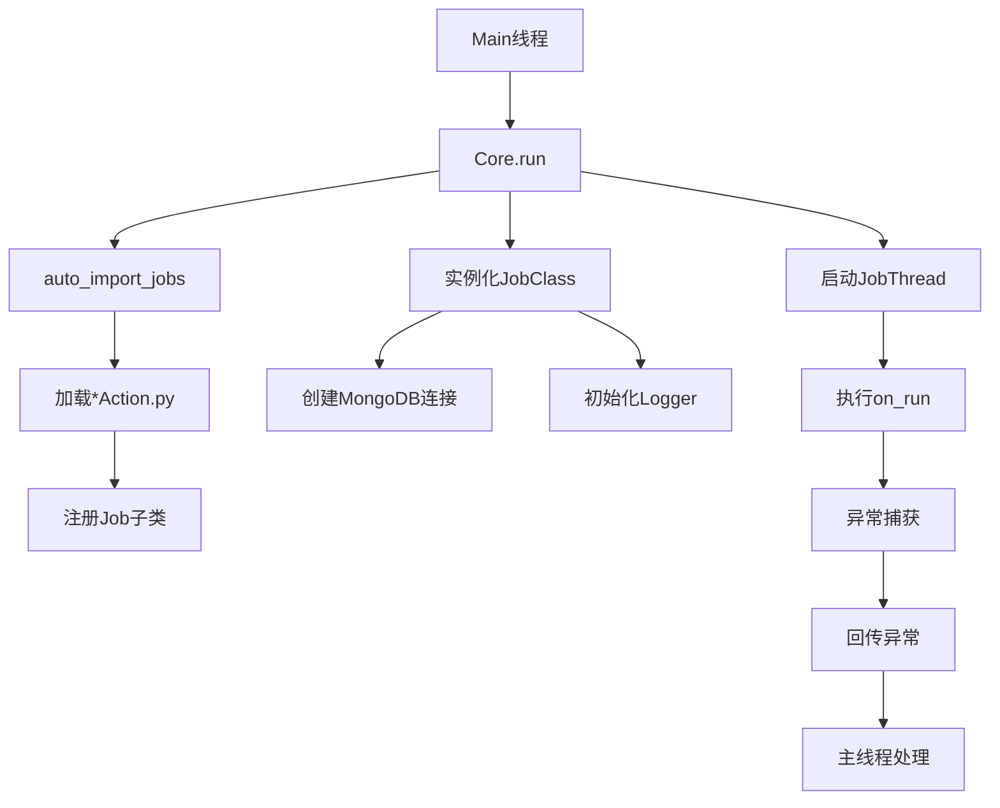

# EasyJob 文档

## 概述

EasyJob 是一个基于 Python 的轻量级任务调度框架，提供任务注册、执行、日志记录和异常处理等功能。核心特点包括：

- 自动任务发现与注册机制
- 线程安全的任务执行
- 完善的日志记录
- 内置重试机制和请求工具
- 数据缓存功能

## 核心组件

### 1. JobBase 基类

所有任务通过继承自 `JobBase` 类，并实现 `on_run()` 等方法。

#### 主要特性：

- **自动注册**：通过 `__init_subclass__` 自动注册所有子类
- **日志集成**：内置 MongoDB 日志记录
- **请求工具**：提供带重试和缓存的 HTTP 请求方法
- **数据持久化**：简单的文件缓存机制

#### 关键方法：

- `on_run()`: 任务主逻辑（必须由子类实现）
- `send_request()`: 带重试和缓存的 HTTP 请求方法
- `dump()`/`get_dump()`: 数据缓存工具

### 2. JobThread 类

继承自 `threading.Thread`，封装了线程异常传递机制，确保子线程异常能在主线程中被捕获。

### 3. MongoDBHandler

自定义日志处理器，将日志记录到 MongoDB 数据库。

## 使用流程



## 示例任务

```python
import os

from Core import JobBase

class DemoAction(JobBase):
    job_id = 100001  # 任务标识 List|Tuple|Set|Int
    folder = os.path.dirname(os.path.abspath(__file__))  # 数据存储目录

    def on_run(self):
        # 任务主逻辑
        response = self.send_request(
            "https://example.com/api",
            method="GET",
            res_type="json"
        )
        self.logger.info(f"Got response: {response}")
```
## 配置说明

框架通过 `config.yaml` 文件配置：

```yaml
jobs:
  base_package: 'Job' # 任务模块的基础包名
  module_pattern: 'Action.py' # 任务模块的文件名模式
mongo:
  uri: 'mongodb://localhost:27017' #  mongodb连接uri
  database: 'EasyJob' #  mongodb数据库名
```

## 自动发现机制

`auto_import_jobs()` 函数会：

1. 扫描 `base_package` 目录下所有匹配 `module_pattern` 的文件
2. 自动导入找到的模块
3. 触发任务类的注册

## 数据库集成

任务信息会自动保存到 MongoDB 的 `EasyJob.Job` 集合中，包含：

- job_id
- job_name
- 类名
- 描述
- 调度配置等

## 异常处理

框架提供多层异常处理：

1. 线程异常传递
2. 请求自动重试
3. 全局异常日志记录

## 请求工具特性

`send_request()` 方法支持：

- 多种返回类型（text/json/content）
- 自动缓存
- 响应验证
- 代理支持
- 自定义超时和重试策略

## 最佳实践

1. 每个任务类放在单独的文件中
2. 使用 `dump()` 方法缓存重要数据
3. 合理设置重试参数
4. 利用日志记录关键操作
5. 为每个任务设置唯一的 job_id

## 扩展性

可以通过以下方式扩展框架：

1. 继承 JobBase 添加通用功能
2. 自定义日志处理器
3. 扩展自动发现逻辑
4. 集成其他存储后端

这个框架特别适合需要稳定执行、完善日志和简单调度的小型自动化任务。